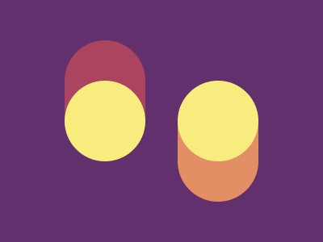
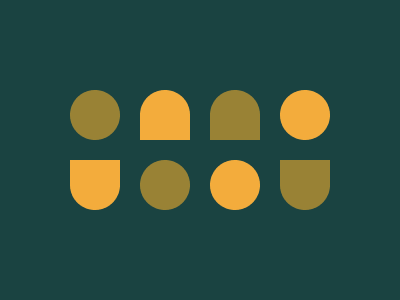

# CSS Battle #4

## [Level 21](https://cssbattle.dev/play/21)


| Character count | Score |
| --- | --- |
| 251 | 636.57 |

```html
<p><p><style>&{background:#222;margin:62 130;p{--a:#F2994A;--b:conic-gradient(var(--a))no-repeat;padding:40 50;position:fixed;background:0%50%/30%100%var(--b),50%0/100%38%var(--b);border-radius:10px 0;rotate:315deg;+p{--a:#2D9CDB;scale:-1;margin:64 23
```

## [Level 22](https://cssbattle.dev/play/22)


| Character count | Score |
| --- | --- |
| 226 | 646.41 |

```html
<style>&{background:-50px 5vh radial-gradient(1q,#D86F45 50px,#0000),30px -5vh radial-gradient(1q,#D86F45 50px,#0000),75px 5ch radial-gradient(1q,#D86F45 25px,#0000),155px 55vh/15ch 50px conic-gradient(#D86F45)no-repeat#F5D6B4
```

## [Level 23](https://cssbattle.dev/play/23)


| Character count | Score |
| --- | --- |
| 113 | 736.25 |

```html
<style>*{background:#F3AC3C;*{margin:200 200 50 150;box-shadow:-25px -25px 0 25px#998235,25px -75px 0 75px#1A4341
```

## [Level 24](https://cssbattle.dev/play/24)


| Character count | Score |
| --- | --- |
| 205 | 656.69 |

```html
<p><p><style>&{background:#62306D;p{position:fixed;background:radial-gradient(1q at 50%75pt,#F7EC7D 50px,var(--a,#AA445F));border-radius:1in;padding:75 50;margin:42 72;+p{scale:-1;margin:92 212;--a:#E38F66
```

## [Level 25](https://cssbattle.dev/play/25)


| Character count | Score |
| --- | --- |
| 229 | 645.1 |

```html
<p><p><p><p><style>&{background:#998235;p{margin:52 102;background:#1A4341;padding:50 40;border-radius:0 50px;position:fixed;+p{scale:-1 1;margin:132 202;+p{margin:52 202;padding:30 40;background:#F3AC3C;+p{scale:1;margin:172 102
```

## [Level 26](https://cssbattle.dev/play/26)


| Character count | Score |
| --- | --- |
| 188 | 666.66 |

```html
<style>&{--a:radial-gradient(1q,#0000 42q,#060F55 0 63q,#0000);background:0 25vw/100%25vw conic-gradient(#6592CF)no-repeat,-100px -50px var(--a),100px -50px var(--a),0 50px var(--a)#6592CF
```

## [Level 27](https://cssbattle.dev/play/27)


| Character count | Score |
| --- | --- |
| 142 | 703.34 |

```html
<style>&{background:radial-gradient(1q,#AA445F 42q,#0000 0 74q,#AA445F 0 106q,#E38F66 0),repeating-conic-gradient(#F7EC7D 0 25%,#AA445F 25%50%
```

## [Level 28](https://cssbattle.dev/play/28)


| Character count | Score |
| --- | --- |
| 293 | 624.5 |

```html
<p><p><p><style>&{background:#1A4341;p{position:fixed;padding:25;color:998235;border-radius:50%;box-shadow:62px 66px,99pt 17ch,34ch 66px#F3AC3C,202px 17ch#F3AC3C;+p{box-shadow:62px 17ch#F3AC3C,34ch 17ch;border-radius:0%0%50%50%;+p{box-shadow:99pt 66px#F3AC3C,202px 66px;border-radius:50%50%0%0
```
