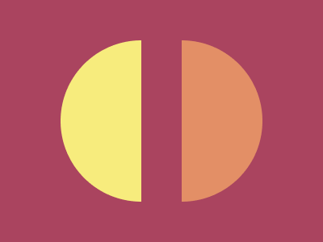

# CSS Battle #6

## [Level 31](https://cssbattle.dev/play/31)


| Character count | Score |
| --- | --- |
| 136 | 709.43 |

```html
<style>*{background:radial-gradient(1q at var(--a,185q,#F7EC7D)25vw,#AA445F 0);*{margin:0 0 0 185q;border:53q solid#AA445F;--a:0,#E38F66
```

## [Level 32](https://cssbattle.dev/play/32)


| Character count | Score |
| --- | --- |
| 202 | 658.33 |

```html
<p><p><style>p{background:#F3AC3C;padding:25 100;margin:117 92;position:fixed;transform:rotate(45deg);+p{background:linear-gradient(90deg,#A3A368 75px,#FBE18C 0 125px,#A3A368 0);transform:rotate(135deg)
```
